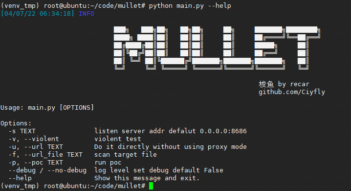
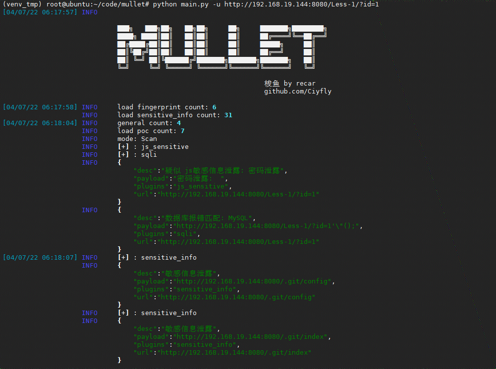
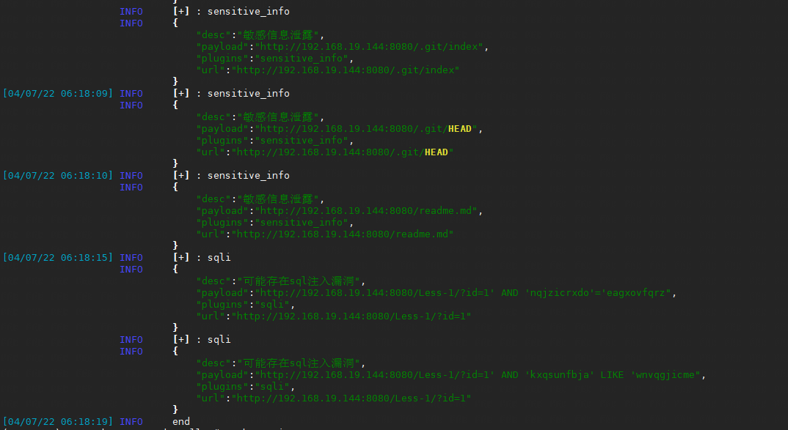
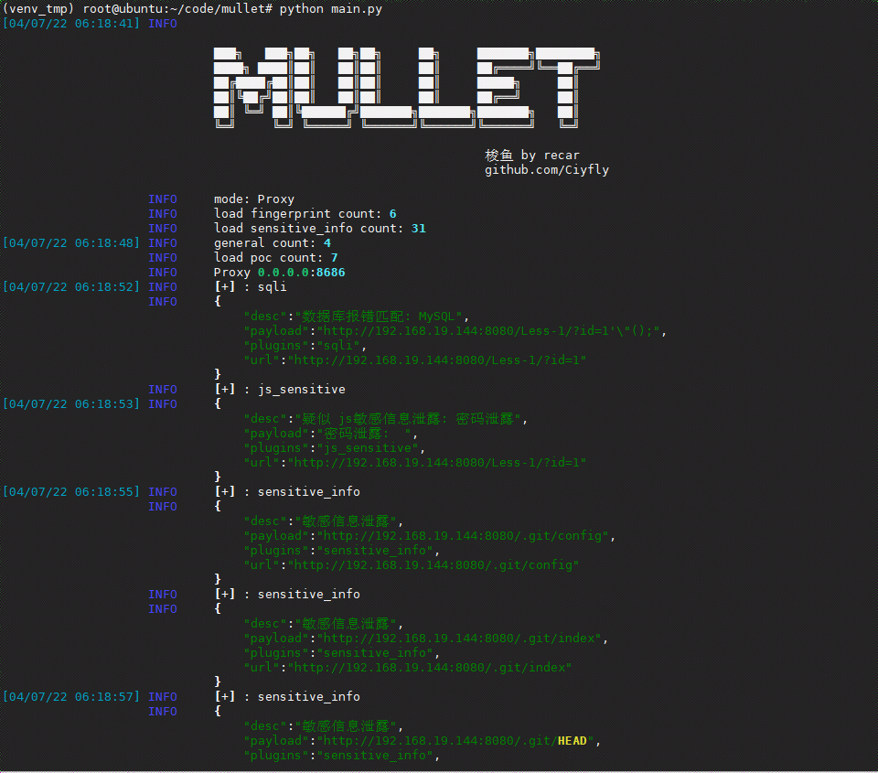
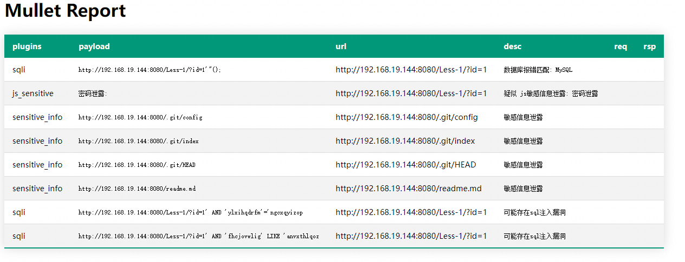
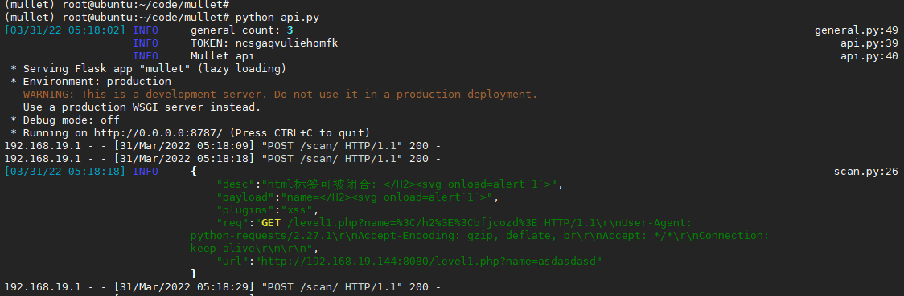

<!--
 * @Date: 2022-01-11 18:08:25
 * @LastEditors: recar
 * @LastEditTime: 2022-04-07 18:32:42
-->
# mullet
扫描器 梭鱼  
支持主动 被动扫描的方式  

被动通过 mitm 支持 所以需要安装证书  
`安装证书 代理开启后访问 http://mitm.it/`  

poc是跟指纹关联的 指纹匹配了才会发对应的poc  

采用统一请求的方式 限流 所有发的请求都会被限流  
内部多个插件使用多生产多消费的模式  


## 安装

仅支持python3的环境  

```shell
git clone git@github.com:Ciyfly/mullet.git
cd mullet
python3 -m venv venv
source venv
pip install --upgrade pip
pip install -r requirements.txt
python main.py --help
```

## 使用



### 主动扫描
`python main.py -u "http://192.168.19.144:8080/level1.php?name=asdasdasd"`  





### 被动扫描

默认监听`8686` 端口  
`python main.py`



## 报告
输出报告是html格式的在 output目录下  



## api
支持 web 的api形式 创建扫描 默认监听`8787`端口
api 会先随机生成token api需要携带toekn参数才能创建任务  

server `python api.py`  
client   
```shell
curl -X POST \
  http://192.168.19.144:8787/scan/ \
  -H 'content-type: application/json' \
  -d '{
	"url":"http://192.168.19.144:8080/level1.php?name=asdasdasd",
	"token": "ncsgaqvuliehomfk"
}'
```




## 检测
通用检测  

- sqli
- xss
- jsonp

指纹

指纹采用的是单个脚本的形式 有一些特殊情况靠配置文件或者json不好处理  

- shiro
- struts2
- thinkphp

poc 

- shiro_default_key
- spring CVE-2022-22947
- s2_061
- s2_059
- s2_057
- ThinkPHP5_5_0_22


## 配置文件  
配置文件在 config/config.ini
```ini
[options]
; model=debug
model=info
[reverse]
ceye_domain=y9be3e.ceye.io
ceye_token=e3764fbde6dad1a2a8fd85be90ba42c9

; 插件的开关控制
[switch]
fingerprint=False
sensitive_info=False
general=True
poc=False
; 通用插件的开关
[switch_general]
; list=jsfind,jsonp,sqli,xss,js_sensitive
list=xss

# 速率限制
[rate]
max_calls=10
period=1
# 网络请求的默认超时时间
timeout=3

# 白名单
[white_list]
list=google.com,gov.cn,googleapis.com,github.com
```
## 参考
https://github.com/w-digital-scanner/w13scan/  
https://github.com/sqlmapproject/sqlmap  
https://mp.weixin.qq.com/s?__biz=MzU2NzcwNTY3Mg==&mid=2247483698&idx=1&sn=9733c6078516c34963a4c0486c6d1872&chksm=fc986815cbefe103975c2e554ef2667b931e14b2d1dcca407af9edbad83ea72f3ac88efd8d22&mpshare=1&scene=1&srcid=&sharer_sharetime=1588849508551&sharer_shareid=19604935512cdb60a84a4a498605fc8d&key=e4739a048b456af8bbf436c6fb2173754f53fcd63e766a439186e0a2433cd084a69e23876cc446623cb005c3c9fed06af918b7b082f604e7a23c136961d5a1e633f4a60b65b241dea730f7c13578ea94&ascene=1&uin=MTM3MzQ3ODE0MA%3D%3D&devicetype=Windows+10&version=62080079&lang=zh_CN&exportkey=AZ%2F8pd18PHTzKD6ytyi7PPk%3D&pass_ticket=ssxjxDrN0aRCdy2TGXV37%2Bg0cYgtEknB95Y1dXjxGOtpxjCYC6wfPOq5QXvs3lzE  

## 声明
使用mullet前请遵守当地法律,mullet仅提供给教育行为使用。
