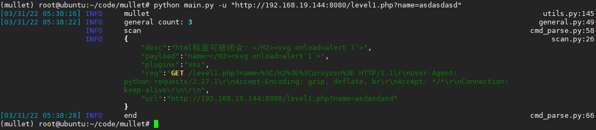

<!--
 * @Date: 2022-01-11 18:08:25
 * @LastEditors: recar
 * @LastEditTime: 2022-03-31 17:40:20
-->
# mullet
扫描器 梭鱼  
支持主动 被动扫描的方式  

被动通过 mitm 支持 所以需要安装证书  
`安装证书 代理开启后访问 http://mitm.it/`  

poc是跟指纹关联的 指纹匹配了才会发对应的poc  

## 使用

### 主动扫描

`python main.py -u "http://192.168.19.144:8080/level1.php?name=asdasdasd"`  



### 被动扫描

默认监听`8686` 端口  
`python main.py`

## api
支持 web 的api形式 创建扫描 默认监听`8787`端口
api 会先随机生成token api需要携带toekn参数才能创建任务  

server `python api.py`  
client   
```shell
curl -X POST \
  http://192.168.19.144:8787/scan/ \
  -H 'content-type: application/json' \
  -d '{
	"url":"http://192.168.19.144:8080/level1.php?name=asdasdasd",
	"token": "ncsgaqvuliehomfk"
}'
```


## 检测
通用检测  

- sqli
- xss
- jsonp

指纹

- shiro
- struts2
- thinkphp

poc 

- shiro_default_key
- spring CVE-2022-22947
- s2_061
- s2_059
- s2_057
- ThinkPHP5_5_0_22
